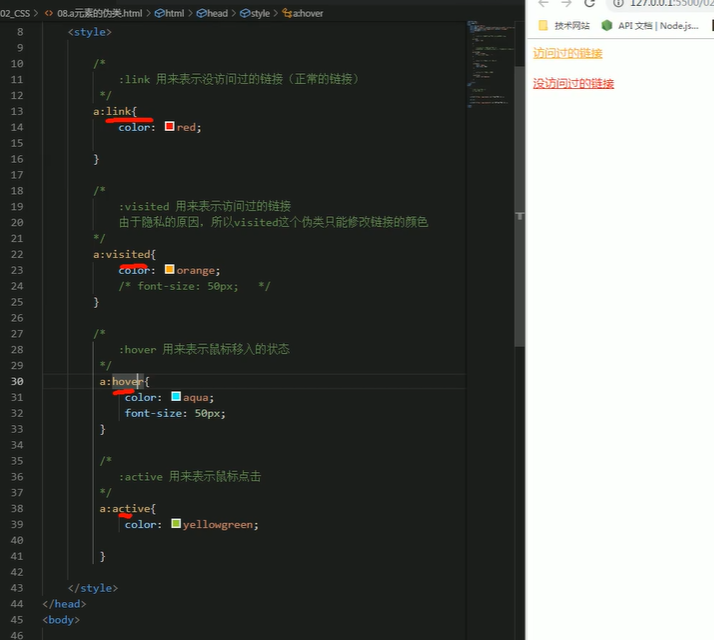
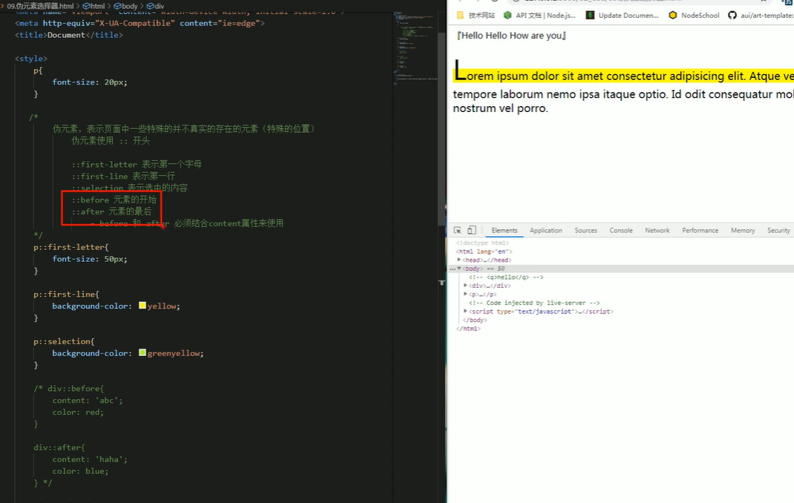
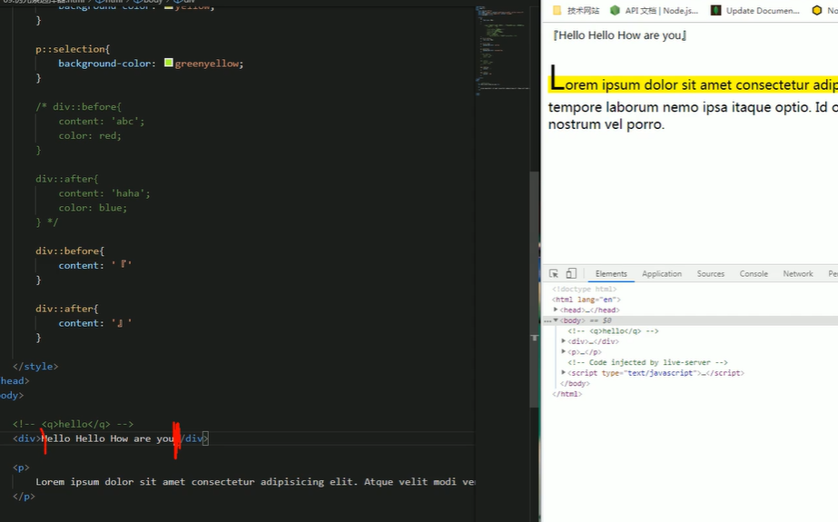
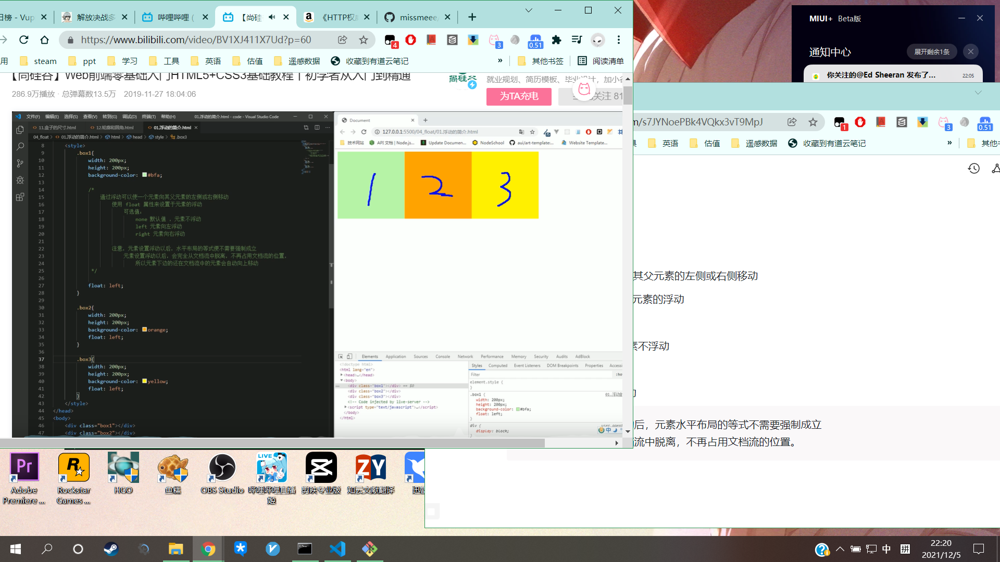
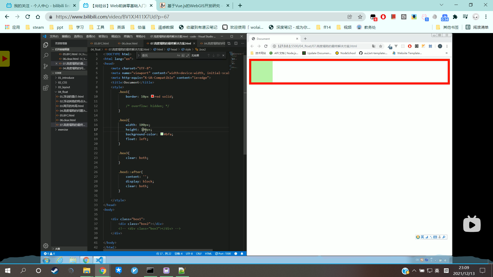

# CSS学习


# 1 选择器

## 1.1复合选择器


### 1.1.1交集选择器：

- 作用：选中同时符合多个条件的元素
- 语法：选择器1选择器2选择器3选择器n( )
- 注意点：
   **交集选择器中如果有元素选择器，必须使用元素选择器开头。**

```css
div.red{
    font-size:30px;
}
```


### 1.1.2选择器分组（并集选择器）

- 作用：同时选择多个对应的元素
- 语法：选择器1，选择器2，选择器3，选择器n{ }
```css
h1,span{
    color:red;
}
```


## 1.2 关系选择器

- 父元素    - 直接包含子元素的元素
- 子元素    - 直接被父元素包含的元素
- 祖先元素 - 直接或间接包含后代元素的元素（一个元素的父元素也是它的祖先元素）
- 后代元素 - 直接或间接包含祖先元素的元素（一个元素的子元素也是它的后代元素）
- 兄弟元素 - 拥有相同父元素的元素是兄弟元素


```css
/*
子元素选择器
    语法： 父元素 > 子元素
*/
div.box > span{
  color:orange;
}

/*
 后代元素选择器
     语法：祖先 后代
*/
div span{
    color:skyblue;
}

/*
  选择下一个兄弟
      语法：前一个 + 下一个
  选择下面所有兄弟元素
      语法：兄 ~ 第
*/

p + span{
    color:red;
}

p ~ span{
    color:red;
}

```


## 1.3 属性选择器

 [属性名]  选择含有指定属性的元素

 [属性名 = 属性值] 选择含有指定属性和属性值的元素

 [属性名 ^= 属性值] 选择指定属性值开头的元素

 [属性名 $= 属性值] 选择指定属性值结尾的元素

 [属性名 *= 属性值] 选择属性值含有某值的元素

```css
p[title=abc]{
    color:orange;
}

p[title ^= abc]{
    color:orange;
}
```


## 1.4 伪类选择器

伪类（不存在的类，特殊的类）

-伪类用来描述一个元素的特殊状态

比如：第一个子元素，被点击的子元素，鼠标移入的元素。。。

-伪类一般情况使用冒号开头

:first-child       第一个子元素

:lsat-child        最后一个子元素

:nth-child()     选中第n个子元素

      特殊值：  n 第n个，n的范围0到正无穷

                 2n 或even      表示选中偶数位元素

             2n+1 或odd  表示选中奇数位元素

:first-of-type

:last-of-type

:nth-of-type()


## 1.5 超链接伪类

:link  用来表示没访问过的链接（正常的链接）

:visited  用来表示访问过的链接

```css
a:link{
    color:red;
}

a:visited{
    color:orange;
}
```


:hover   用来表示鼠标移入的状态

:active  用来表示鼠标点击

```css
a:hover{
    color:aqua;
    font-size:50px;
}

a:active{
    color:yellowgreen;
}
```





## 1.6 伪元素

伪元素：表示页面中一些特殊的并不真实存在的元素（特殊的位置）

伪元素使用 : : 开头


`::first-letter` 表示第一个字母

`::first-line`  表示第一行

`::selection` 表示选中的内容

`::before`  元素的开始

`::after`  元素的最后

— `before`和`after`必须结合`content`属性来使用






## 1.7选择器的权重

发生样式冲突时，应用哪个样式由选择器的权重（优先级）决定


选择器的权重

|选择器|权重|
|---|---|
|内联样式|1,0,0,0|
|id选择器|0,1,0,0|
|类和伪类选择器|0,0,1,0|
|元素选择器|0,0,0,1|
|通配选择器|0,0,0,0|
|继承的样式|没有优先级|


比较优先级时，需要将所有的选择器的优先级进行相加计算，最后优先级越高，则越优先显示（分组选择器单独计算）

选择器的累加不会超过其最大数量级，类选择器再高也不会超过id选择器

如果优先级计算后相同，此时则优先使用靠下的样式


可以在某个样式的后面添加 !important ，此时该样式会获得最高优先级，甚至超过内联样式**（慎用）**


# 2 Layout
## 2.1 文档流


- 网页是个多层结构，一层摞着一层
- 通过CSS可以分别为每一层来设置样式
- 作为用户来讲只能看到最顶上一层
- 这些层中，最底下的一层称为文档流，文档流是网页的基础
	我们所创建的元素默认都是在文档流中进行排列
- 对于我们来元素主要有两个状态：在文档流中和不在文档流中
- 元素在文档流中特点：
	- 块元素
		- 块元素会在页面中独占一行（自上向下垂直排列）
		- 默认宽度是父元素的全部（会把父元素撑满）
		- 默认高度是被内容撑开
	- 行内元素
		- 行内元素不会独占页面的一行，只占自身的大小
		- 行内元素在页面从左向右水平排列，如果一行之中不能则元素会换到第二行继续自左向右排列
		- 行内元素的默认宽度和高度都是被内容撑开

## 2.2 盒子模型

1. CSS将页面中的所有元素都设置为了一个矩形的盒子
2. 将元素设置为矩形的盒子后，对页面的布局就变成将不同的盒子摆放到不同的位置
3. 每一个盒子都由以下几个部分组成：
- 内容区（content）
	**内容区的大小由width和height两个属性来设置**
	* width 设置内容区的宽度
	* height 设置内容区的高度
- 内边距（padding）
	**内容区和边框之间的距离为padding，一共有四个方向的内边距。**
	* padding-top
	* padding-right
	* padding-bottom
	* padding-left
	
    >- 内边距的设置会影响到盒子的大小
    >- 背景颜色会延申到内边距上
    >- 一个盒子的可见框的大小由内容区、内边距和边框共同决定
    >- padding内边距的简写属性，可同时指定四个方向的内边距，规则同边框。
- 边框（border）
	* 简写属性    border: solid 10px orange        ( border-xxx:)
	* 边框的大小会影响到整个盒子的大小
	* 要设置边框，需要至少设置三个样式，
- 边框的宽度：border-width   （默认值3px）
	
    值的情况：
	>- 四个值：上  右  下  左
	>- 三个值：上  左右  下
	>- 两个值：上下  左右
	
    除了border-width还有一组border-xxx-width，用来单独指定某一边的宽度。

- 边框的颜色：border-color   （可分别指定四个边框，规则同上）

- 边框的样式：border-style    （可分别指定四个边框，规则同上）
	- solid 实线
	- dotted 点状虚线
	- dashed 虚线
	- double 双线
- 外边距（margin）  **外边距不会影响盒子可见框的大小，但是外边距会影响盒子的位置**
	- 一共有四个方向的外边距：
      - margin-top
      - margin-right
      - margin-left
      - margin-bottom
  
    **margin可以设置负值，元素往相反方向移动。**

	—  元素在页面中是按照自左向右的顺序排列的。
	>所以默认情况下如果我们设置的左和上边距则会移动自己， 
	>而设置下和右边距会移动其他元素 

	—  简写属性和边框一样。

	—  margin会影响到盒子实际占据空间的大小。


# 3 浏览器默认样式

通常情况下，浏览器都会为元素设置一些默认样式。

默认样式的存在会影响到页面的布局，通常情况下编写网页时必须要去除浏览器的默认样式（PC端）


```css
*{
  margin:0;
  padding:0;
}
```


**重置样式表**：专门用来对浏览器的样式进行重置的

`reset.css` 直接去除了浏览器的默认样式

`normalize.css` 对默认样式进行了统一


[浮动](%E6%B5%AE%E5%8A%A8/%E6%B5%AE%E5%8A%A8.md)
# 4 浮动
## 4.1 浮动简介

通过浮动可以使一个元素向其父元素的左侧或右侧移动

通过`float`属性来设置于元素的浮动

可选值：

`none` 默认值、元素不浮动

`left` 元素向左浮动

`right` 元素向右浮动

**注意：元素设置浮动后，元素水平布局的等式不需要强制成立**                                                                       且元素会完全从文档流中脱离，不再占用文档流的位置。

> 浮动的特点：
> 1. 浮动元素会完全从文档流中脱离，不再占用文档流的位置。
> 2. 设置浮动以后元素会向父元素的左侧或右侧移动。
> 3. 浮动元素默认不会从父元素中移出。
> 4. 浮动元素向左或向右移动时，不会超过它前边的其他浮动元素。
> 5. 如果浮动元素的上边是一个没有浮动的块元素，则浮动元素无法上移。


## 4.2 浮动的特点

浮动元素不会盖住文字，文字会自动环绕在浮动元素的周围，所以我们可以利用浮动来设置文字环绕图片的效果。


元素设置浮动以后将会从文档流中脱离，从文档流中脱离以后，元素的一些特点也会发生变化。

脱离文档流的特点：

> 块元素：
> 1. 不再独占一行。
> 2. 宽度和高度默认都被内容撑开。

> 行内元素：
> 1. 脱离文档流以后会变成块元素，特点和块元素一样。
> 2. 脱离文档流以后，不再区分行内元素和块元素。

## 4.3 高度塌陷和BFC

### 4.3.1高度塌陷的问题

在浮动布局中，父元素的高度默认是被子元素撑开的

当子元素浮动后，其会完全脱离文档流，子元素从文档流中脱离

将会无法撑起父元素的高度，导致父元素的高度丢失

父元素高度丢失以后，其下方的元素会自动上移，导致页面的布局混乱

所以高度塌陷是浮动布局中比较常见的一个问题，这个问题我们必须进行处理。


### 4.3.2 BFC（Block Formatting Context）块级格式化环境

BFC是CSS中的一个隐含的属性，可以为一个元素开启BFC

开启BFC后该元素会变成一个独立的布局区域

元素开启BFC后的特点：

1. 开启BFC的元素不会被浮动元素所覆盖
2. 开启BFC的元素子元素和父元素外边距不会重叠
3. 开启BFC的元素可以包含浮动的子元素

可以通过一些特殊的方式来开启元素的BFC
1. 设置元素的浮动（不推荐）
2. 将元素设置为行内块元素（不推荐）
3. 将元素的`overflow`设置为一个非`visible`的值**（推荐，副作用较小）**
	
	常用的方式为元素设置`overflow: hidden` 开启其BFC（使其可以包含浮动元素）

## 4.4 clear

如果我们不希望某个元素因为其他元素浮动的影响而改变位置，

可以通过clear属性来清除浮动元素对当前元素所产生的影响


clear

- 作用：清除浮动元素对当前元素所产生的影响
- 可选项：

	*	left  清除左侧浮动元素对当前元素的影响
	*	right 清除右侧元素对当前元素的影响
	*	both 清除两侧中最大影响的那侧


**原理：**

设置清除浮动以后，浏览器会自动为元素添加一个上外边距，以便其位置不受其他元素的影响。
## 4.5 使用after伪类解决高度塌陷

```html
<style>
  .box1{
    border:10px red soild;
    /* overflow:hidden */
  }
  
  .box2{
    width:100px;
    height:100px;
    background-color:#bfa;
    float:left;
  }
  
  .box3{
    clear:both;
  }
  
  .box1::after{
    content:'';
    display:block;
    clear:both;
  }
</style>

<body>
  <div class="box1">
    <div class='box2'></div>
    <!--<div class="box3"></div> -->
  </div>
</body>
```



# 4.6 Clearfix

`clearfix` 这个样式可以同时解决高度塌陷和外边距重叠的问题，当你在遇到这些问题时，直接使用`clearfix`这个类即可。

```css
.clearfix::before,
.clearfix::after{
    content:'';
    display:table;
    clear:both;
}
```


[网页的布局](%E7%BD%91%E9%A1%B5%E7%9A%84%E5%B8%83%E5%B1%80/%E7%BD%91%E9%A1%B5%E7%9A%84%E5%B8%83%E5%B1%80.md)

[Position](Position/Position.md)

[字体和背景](%E5%AD%97%E4%BD%93%E5%92%8C%E8%83%8C%E6%99%AF/%E5%AD%97%E4%BD%93%E5%92%8C%E8%83%8C%E6%99%AF.md)

[HTML](HTML/HTML.md)

[动画](%E5%8A%A8%E7%94%BB/%E5%8A%A8%E7%94%BB.md)

[less](less/less.md)

[flex](flex/flex.md)

[移动端页面](%E7%A7%BB%E5%8A%A8%E7%AB%AF%E9%A1%B5%E9%9D%A2/%E7%A7%BB%E5%8A%A8%E7%AB%AF%E9%A1%B5%E9%9D%A2.md)

[媒体查询](%E5%AA%92%E4%BD%93%E6%9F%A5%E8%AF%A2/%E5%AA%92%E4%BD%93%E6%9F%A5%E8%AF%A2.md)

添加一个页面

[新页面](%E6%96%B0%E9%A1%B5%E9%9D%A2/%E6%96%B0%E9%A1%B5%E9%9D%A2.md)


