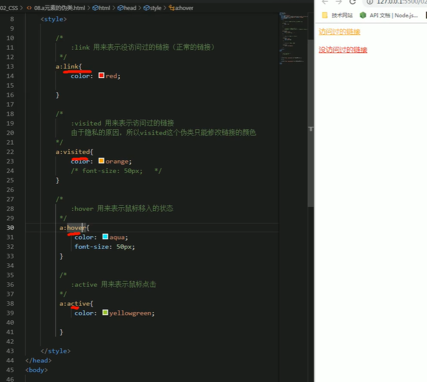
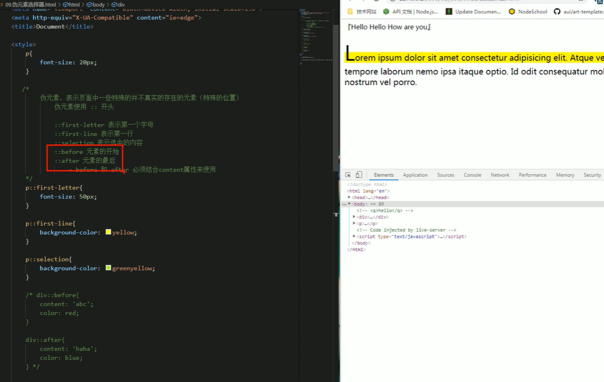
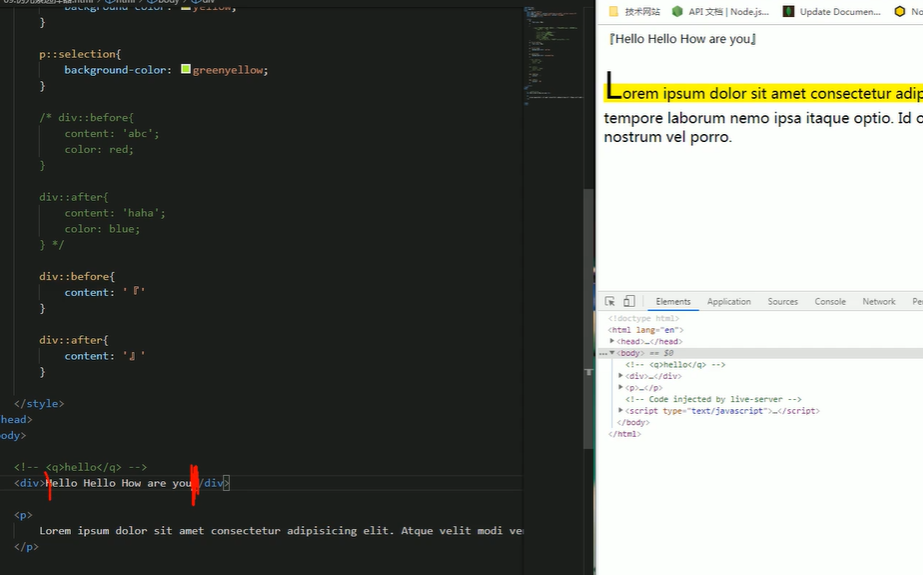

# CSS学习


## 1 选择器

### 1.1复合选择器


#### 1.1.1交集选择器：

- 作用：选中同时符合多个条件的元素
- 语法：选择器1选择器2选择器3选择器n( )
- 注意点：
   **交集选择器中如果有元素选择器，必须使用元素选择器开头。**

```css
div.red{
    font-size:30px;
}
```


#### 1.1.2选择器分组（并集选择器）

- 作用：同时选择多个对应的元素
- 语法：选择器1，选择器2，选择器3，选择器n{ }
```css
h1,span{
    color:red;
}
```


### 1.2 关系选择器

- 父元素    - 直接包含子元素的元素
- 子元素    - 直接被父元素包含的元素
- 祖先元素 - 直接或间接包含后代元素的元素（一个元素的父元素也是它的祖先元素）
- 后代元素 - 直接或间接包含祖先元素的元素（一个元素的子元素也是它的后代元素）
- 兄弟元素 - 拥有相同父元素的元素是兄弟元素


```css
/*
子元素选择器
    语法： 父元素 > 子元素
*/
div.box > span{
  color:orange;
}

/*
 后代元素选择器
     语法：祖先 后代
*/
div span{
    color:skyblue;
}

/*
  选择下一个兄弟
      语法：前一个 + 下一个
  选择下面所有兄弟元素
      语法：兄 ~ 第
*/

p + span{
    color:red;
}

p ~ span{
    color:red;
}

```


### 1.3 属性选择器

 [属性名]  选择含有指定属性的元素

 [属性名 = 属性值] 选择含有指定属性和属性值的元素

 [属性名 ^= 属性值] 选择指定属性值开头的元素

 [属性名 $= 属性值] 选择指定属性值结尾的元素

 [属性名 *= 属性值] 选择属性值含有某值的元素

```css
p[title=abc]{
    color:orange;
}

p[title ^= abc]{
    color:orange;
}
```


### 1.4 伪类选择器

伪类（不存在的类，特殊的类）

-伪类用来描述一个元素的特殊状态

比如：第一个子元素，被点击的子元素，鼠标移入的元素。。。

-伪类一般情况使用冒号开头

:first-child       第一个子元素

:lsat-child        最后一个子元素

:nth-child()     选中第n个子元素

      特殊值：  n 第n个，n的范围0到正无穷

                 2n 或even      表示选中偶数位元素

             2n+1 或odd  表示选中奇数位元素

:first-of-type

:last-of-type

:nth-of-type()


### 1.5 超链接伪类

:link  用来表示没访问过的链接（正常的链接）

:visited  用来表示访问过的链接

```css
a:link{
    color:red;
}

a:visited{
    color:orange;
}
```


:hover   用来表示鼠标移入的状态

:active  用来表示鼠标点击

```css
a:hover{
    color:aqua;
    font-size:50px;
}

a:active{
    color:yellowgreen;
}
```





### 1.6 伪元素

伪元素：表示页面中一些特殊的并不真实存在的元素（特殊的位置）

伪元素使用 : : 开头


::first-letter 表示第一个字母

::first-line  表示第一行

::selection 表示选中的内容

::before  元素的开始

::after  元素的最后

— before和after必须结合content属性来使用






### 1.7选择器的权重

发生样式冲突时，应用哪个样式由选择器的权重（优先级）决定


选择器的权重

|选择器|权重|
|---|---|
|内联样式|1,0,0,0|
|id选择器|0,1,0,0|
|类和伪类选择器|0,0,1,0|
|元素选择器|0,0,0,1|
|通配选择器|0,0,0,0|
|继承的样式|没有优先级|


比较优先级时，需要将所有的选择器的优先级进行相加计算，最后优先级越高，则越优先显示（分组选择器单独计算）

选择器的累加不会超过其最大数量级，类选择器再高也不会超过id选择器

如果优先级计算后相同，此时则优先使用靠下的样式


可以在某个样式的后面添加 !important ，此时该样式会获得最高优先级，甚至超过内联样式**（慎用）**


[layout](/CSS/layout/layout.md)

[浏览器默认样式](%E6%B5%8F%E8%A7%88%E5%99%A8%E9%BB%98%E8%AE%A4%E6%A0%B7%E5%BC%8F/%E6%B5%8F%E8%A7%88%E5%99%A8%E9%BB%98%E8%AE%A4%E6%A0%B7%E5%BC%8F.md)

[浮动](%E6%B5%AE%E5%8A%A8/%E6%B5%AE%E5%8A%A8.md)

[网页的布局](%E7%BD%91%E9%A1%B5%E7%9A%84%E5%B8%83%E5%B1%80/%E7%BD%91%E9%A1%B5%E7%9A%84%E5%B8%83%E5%B1%80.md)

[Position](Position/Position.md)

[字体和背景](%E5%AD%97%E4%BD%93%E5%92%8C%E8%83%8C%E6%99%AF/%E5%AD%97%E4%BD%93%E5%92%8C%E8%83%8C%E6%99%AF.md)

[HTML](HTML/HTML.md)

[动画](%E5%8A%A8%E7%94%BB/%E5%8A%A8%E7%94%BB.md)

[less](less/less.md)

[flex](flex/flex.md)

[移动端页面](%E7%A7%BB%E5%8A%A8%E7%AB%AF%E9%A1%B5%E9%9D%A2/%E7%A7%BB%E5%8A%A8%E7%AB%AF%E9%A1%B5%E9%9D%A2.md)

[媒体查询](%E5%AA%92%E4%BD%93%E6%9F%A5%E8%AF%A2/%E5%AA%92%E4%BD%93%E6%9F%A5%E8%AF%A2.md)

添加一个页面

[新页面](%E6%96%B0%E9%A1%B5%E9%9D%A2/%E6%96%B0%E9%A1%B5%E9%9D%A2.md)


