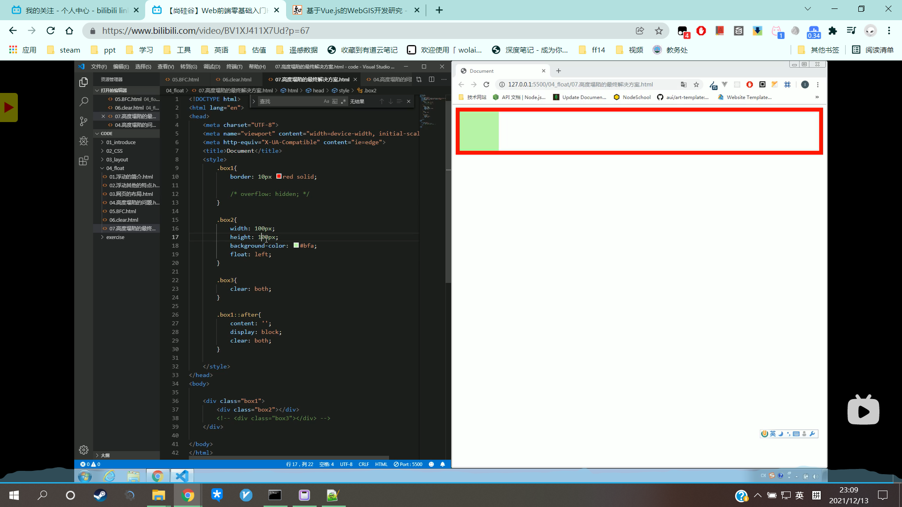

# 使用after伪类解决高度塌陷

```HTML
<style>
  .box1{
    border:10px red soild;
    /* overflow:hidden */
  }
  
  .box2{
    width:100px;
    height:100px;
    background-color:#bfa;
    float:left;
  }
  
  .box3{
    clear:both;
  }
  
  .box1::after{
    content:'';
    display:block;
    clear:both;
  }
</style>

<body>
  <div class="box1">
    <div class='box2'></div>
    <!--<div class="box3"></div> -->
  </div>
</body>
```




