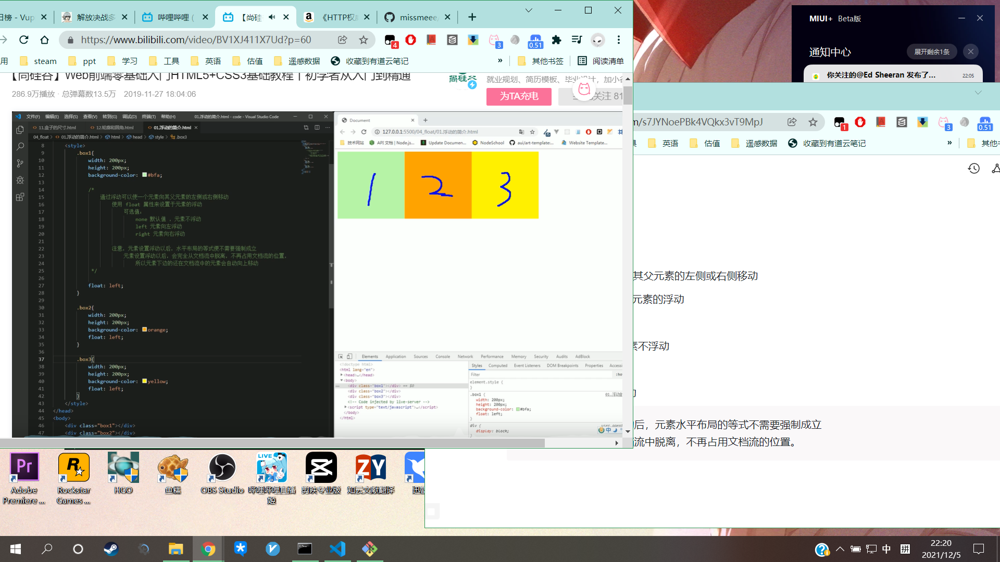

# 浮动简介

通过浮动可以使一个元素向其父元素的左侧或右侧移动

通过float属性来设置于元素的浮动

可选值：

none 默认值、元素不浮动

left 元素向左浮动

right 元素向右浮动

注意：元素设置浮动后，元素水平布局的等式不需要强制成立                                                                         且元素会完全从文档流中脱离，不再占用文档流的位置。

浮动的特点：

1. 浮动元素会完全从文档流中脱离，不再占用文档流的位置。
2. 设置浮动以后元素会向父元素的左侧或右侧移动。
3. 浮动元素默认不会从父元素中移出。
4. 浮动元素向左或向右移动时，不会超过它前边的其他浮动元素。
5. 如果浮动元素的上边是一个没有浮动的块元素，则浮动元素无法上移。

