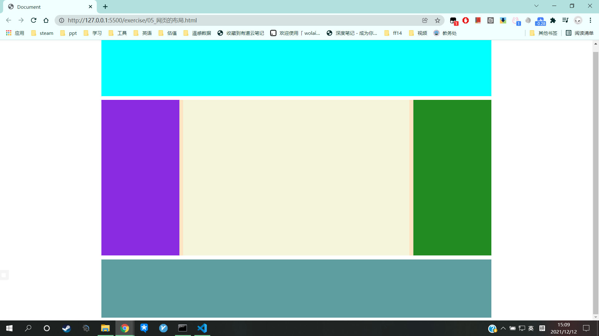

# 网页的布局

```CSS
<style>
    header,main,footer{
        width: 1000px;
        margin:0px auto;
    }
    header{
        height: 150px;
        background-color: aqua;
    }
    main{
        height: 400px;
        background-color: bisque;
        margin: 10px auto;
    }
    #box1{
        float: left;
        width: 200px;
        height: 100%;
        background-color: blueviolet;
    }
    #box2{
        float: left;
        width: 580px;
        height: 100%;
        margin: 0px 10px;
        background-color: beige;
    }
    #box3{
        float: left;
        width: 200px;
        height: 100%;
        background-color: forestgreen;
    }
    footer{
        height: 150px;
        background-color: cadetblue;
    }
</style>
<body>
    <header></header>
    <main>
        <div id="box1"></div>
        <div id="box2"></div>
        <div id="box3"></div>

    </main>
    <footer></footer>
</body>
```




